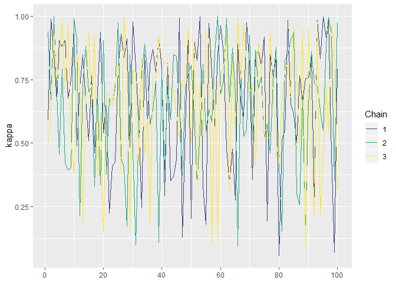
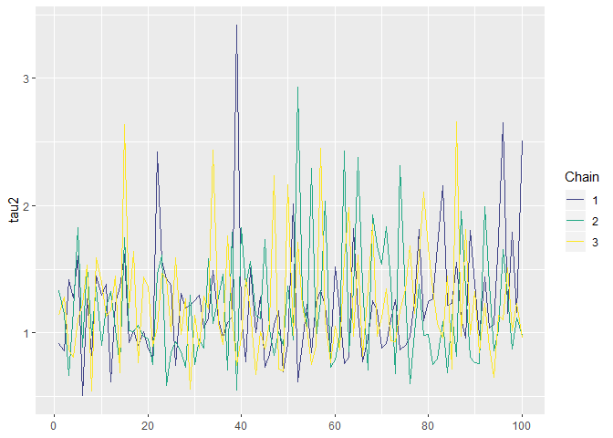
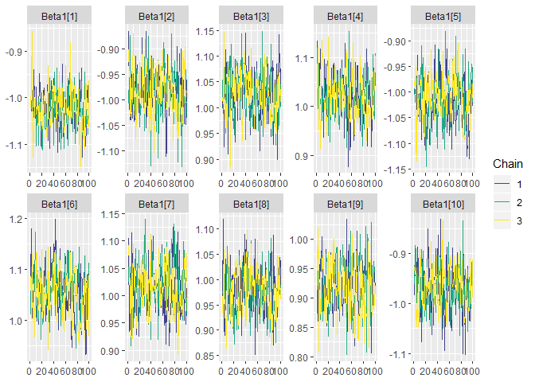
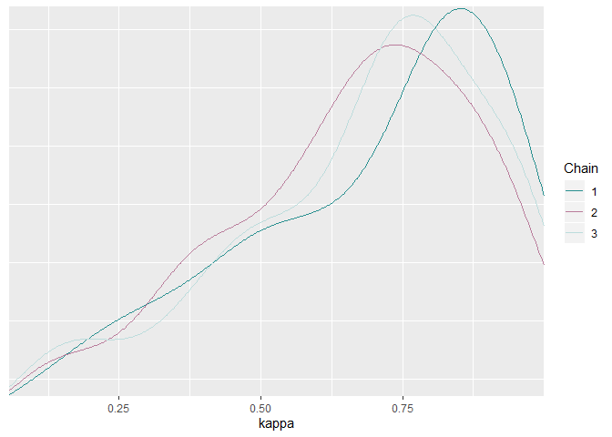
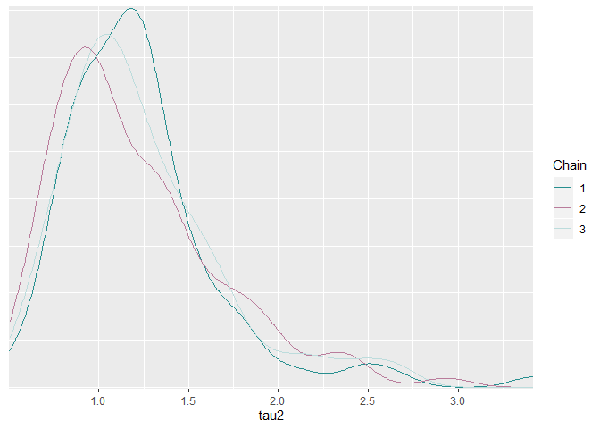
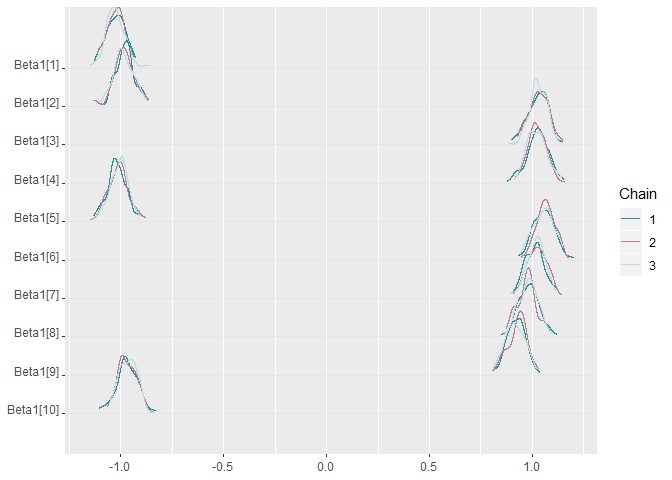
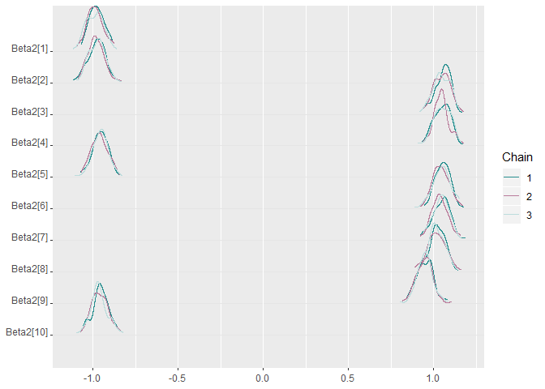
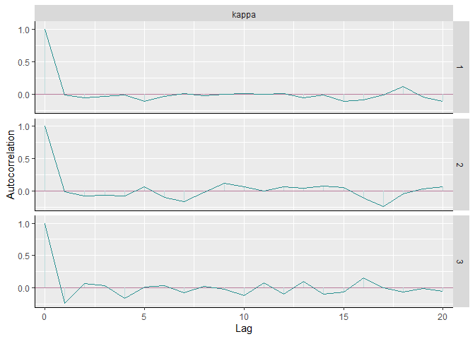
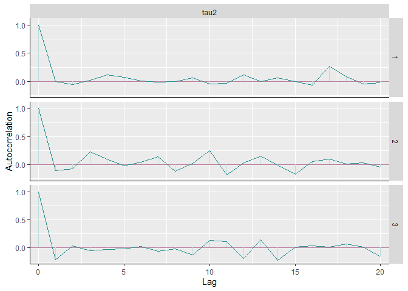

Getting Started
---------------

    library(GCPBayes)

Generating summary statistics
-----------------------------

    set.seed(1)
    mg=10
    SD=diag(0.05,mg)
    corr=0.5
    R=matrix(corr,mg,mg)+(1-corr)*diag(mg)
    Sigma=crossprod(crossprod(SD,R),SD)
    sign=rbinom(mg,1,.5)
    sign[sign==0]=-1
    betat=rep(1,mg)
    betat=betat*sign
    Betah=mvtnorm::rmvnorm(2,betat,Sigma)

    snpnames=1:mg
    genename="simulated_data"

    row.names(Betah)<-c("Study_1","Study_2")
    colnames(Betah)<-sprintf("%s",seq(1:mg))

    row.names(Sigma)<-sprintf("%s",seq(1:mg))
    colnames(Sigma)<-sprintf("%s",seq(1:mg))

    # generated Behath
    #print(Betah)
    #print(Sigma)

### Summary Statistics including betah\_k, Sigmah\_k, k=1,2

#### betah\_k, k=1,2

    |         | 1      | 2      | 3     | 4     | 5      | 6     | 7     | 8     | 9     | 10     |
    |---------|--------|--------|-------|-------|--------|-------|-------|-------|-------|--------|
    | Study_1 | -1.022 | -0.976 | 1.033 | 1.027 | -1.004 | 1.061 | 1.021 | 0.985 | 0.929 | -0.953 |
    | Study_2 | -0.979 | -0.978 | 1.056 | 1.051 | -0.957 | 1.055 | 1.050 | 1.025 | 0.952 | -0.956 |

#### Sigmah\_k, k=1,2

    |    | 1       | 2       | 3       | 4       | 5       | 6       | 7       | 8       | 9       | 10      |
    |----|---------|---------|---------|---------|---------|---------|---------|---------|---------|---------|
    | 1  | 0.0025  | 0.00125 | 0.00125 | 0.00125 | 0.00125 | 0.00125 | 0.00125 | 0.00125 | 0.00125 | 0.00125 |
    | 2  | 0.00125 | 0.0025  | 0.00125 | 0.00125 | 0.00125 | 0.00125 | 0.00125 | 0.00125 | 0.00125 | 0.00125 |
    | 3  | 0.00125 | 0.00125 | 0.0025  | 0.00125 | 0.00125 | 0.00125 | 0.00125 | 0.00125 | 0.00125 | 0.00125 |
    | 4  | 0.00125 | 0.00125 | 0.00125 | 0.0025  | 0.00125 | 0.00125 | 0.00125 | 0.00125 | 0.00125 | 0.00125 |
    | 5  | 0.00125 | 0.00125 | 0.00125 | 0.00125 | 0.0025  | 0.00125 | 0.00125 | 0.00125 | 0.00125 | 0.00125 |
    | 6  | 0.00125 | 0.00125 | 0.00125 | 0.00125 | 0.00125 | 0.0025  | 0.00125 | 0.00125 | 0.00125 | 0.00125 |
    | 7  | 0.00125 | 0.00125 | 0.00125 | 0.00125 | 0.00125 | 0.00125 | 0.0025  | 0.00125 | 0.00125 | 0.00125 |
    | 8  | 0.00125 | 0.00125 | 0.00125 | 0.00125 | 0.00125 | 0.00125 | 0.00125 | 0.0025  | 0.00125 | 0.00125 |
    | 9  | 0.00125 | 0.00125 | 0.00125 | 0.00125 | 0.00125 | 0.00125 | 0.00125 | 0.00125 | 0.0025  | 0.00125 |
    | 10 | 0.00125 | 0.00125 | 0.00125 | 0.00125 | 0.00125 | 0.00125 | 0.00125 | 0.00125 | 0.00125 | 0.0025  |

### runing CS function with

> For running CS we consider three chains (nchains=3), 1000 MCMC
> iteration with burn-in period 500 (niter=1000, burnin=500) and we
> assume sigma2=10^-3. Also we consider kappa0=c(0.5,0.25,0.5),
> tau20=c(1,1.25,1.5), zeta10=rep(zinit\[1\],3) and zeta20
> =rep(zinit\[2\],3) as initial values. The hyperparameters are
> considered as a1=.1, a2=1, c1=0.1 and c2=1,

    Betah1=Betah[1,]; Betah2=Betah[2,];
    Sigmah1=Sigma; Sigmah2=Sigma;
    kappa0=0.5; kappastar0=0.5; sigma20=1; mg=mg;
    a1=0.1; a2=0.1; d1=0.1; d2=0.1; c1=1; c2=1; s20=1; N00=100
    pvalue=2*pnorm(-abs(Betah/sqrt(diag(Sigma))))

    zinit=rep(0,2)
    for(j in 1:2){
      index=1:mg
      PVALUE=p.adjust(pvalue[j,])
      SIGNALS=index[PVALUE<0.05]
      modelf1=rep(0,mg)
      modelf1[SIGNALS]=1
      if(max(modelf1)==1)(zinit[j]=1)
    }

    res2 = CS(Betah1, Betah2,
              Sigmah1, Sigmah2,
              kappa0=c(0.5,0.25,0.5), tau20=c(1,1.25,1.5),
              zeta10=rep(zinit[1],3), zeta20 =rep(zinit[2],3),
              mg=mg, niter=1000, burnin=500,
              nchains=3, nthin=5, a1=.1, a2=1, c1=0.1, c2=1,
              sigma2=10^-3, snpnames, genename)

    #print(round(res2$Outputs[[1]]$`Statistics of Trait 1 for Beta_1`,digits=2))
    #print(round(res2$Outputs[[1]]$`Statistics of Trait 2  for Beta_2`,digits=2))
    #print(round(res2$Outputs[[1]]$`Other Parameters`,digits=2))
    #print(round(res2$BGR[[1]],digits=2))
    #print(round(res2$BGR[[2]],digits=2))

#### Statistics of Trait 1 for Beta\_1 (only for chain 1)

    |       | Name of SNP | Mean  | SD   | val2.5pc | Median | val97.5pc |
    |-------|-------------|-------|------|----------|--------|-----------|
    | [1,]  | 1           | 0.88  | 0.05 | 0.79     | 0.87   | 0.96      |
    | [2,]  | 2           | 0.96  | 0.05 | 0.84     | 0.96   | 1.07      |
    | [3,]  | 3           | 0.99  | 0.05 | 0.91     | 1      | 1.09      |
    | [4,]  | 4           | 0.95  | 0.05 | 0.84     | 0.95   | 1.04      |
    | [5,]  | 5           | 0.98  | 0.05 | 0.88     | 0.98   | 1.07      |
    | [6,]  | 6           | 1     | 0.04 | 0.91     | 1      | 1.08      |
    | [7,]  | 7           | 0.98  | 0.05 | 0.88     | 0.98   | 1.07      |
    | [8,]  | 8           | 0.98  | 0.04 | 0.89     | 0.98   | 1.04      |
    | [9,]  | 9           | -0.95 | 0.05 | -1.04    | -0.95  | -0.87     |
    | [10,] | 10          | -1.06 | 0.05 | -1.15    | -1.06  | -0.97     |

#### Statistics of Trait 2 for Beta\_2 (only for chain 1)

    |       | Name of SNP | Mean  | SD   | val2.5pc | Median | val97.5pc |
    |-------|-------------|-------|------|----------|--------|-----------|
    | [1,]  | 1           | 1.04  | 0.05 | 0.95     | 1.05   | 1.14      |
    | [2,]  | 2           | 0.96  | 0.05 | 0.84     | 0.97   | 1.06      |
    | [3,]  | 3           | 0.96  | 0.05 | 0.89     | 0.96   | 1.05      |
    | [4,]  | 4           | 1.04  | 0.04 | 0.94     | 1.04   | 1.13      |
    | [5,]  | 5           | 0.98  | 0.05 | 0.89     | 0.97   | 1.07      |
    | [6,]  | 6           | 1.15  | 0.05 | 1.04     | 1.16   | 1.24      |
    | [7,]  | 7           | 0.98  | 0.05 | 0.88     | 0.98   | 1.07      |
    | [8,]  | 8           | 0.98  | 0.05 | 0.89     | 0.98   | 1.08      |
    | [9,]  | 9           | -1    | 0.05 | -1.1     | -1     | -0.92     |
    | [10,] | 10          | -1.04 | 0.05 | -1.14    | -1.05  | -0.94     |

#### Statistics of Other Parameters (only for chain 1)

    |       | Mean | SD   | val2.5pc | Median | val97.5pc |
    |-------|------|------|----------|--------|-----------|
    | kappa | 0.7  | 0.24 | 0.2      | 0.75   | 0.98      |
    | tau2  | 1.17 | 0.39 | 0.59     | 1.09   | 2.21      |

#### Gelman-Rubin convergence diagnostic for Beta\_k, k=1,2

    |       | Name of SNP | BGR for Beta_1 | BGR for Beta_2 |
    |-------|-------------|----------------|----------------|
    | [1,]  | 1           | 1.02           | 1.01           |
    | [2,]  | 2           | 1              | 0.98           |
    | [3,]  | 3           | 0.98           | 1.03           |
    | [4,]  | 4           | 1.03           | 1.04           |
    | [5,]  | 5           | 1.03           | 1              |
    | [6,]  | 6           | 1              | 1              |
    | [7,]  | 7           | 1.04           | 1.06           |
    | [8,]  | 8           | 0.99           | 1.01           |
    | [9,]  | 9           | 1.03           | 1.02           |
    | [10,] | 10          | 0.96           | 1              |

#### Gelman-Rubin convergence diagnostic for Other Parameters

    |      | kappa | tau2 |
    |------|-------|------|
    | [1,] | 1.04  | 0.99 |

### Trace, density and ACF Plots for unknown parameters

### Importatnt criteria of chain 1

> The output of this part includes log\_10BF and lBFDR for testing H0,
> theta for detecting group and detecting variable pleiotropy using the
> number of studies for each variable with nonzero signal by CI.

    #print(res2$Outputs[[1]]$Criteria)

    ## $`Name of Gene`
    ## [1] "simulated_data"

    ## $`Name of SNP`
    ## [1]  1  2  3  4  5  6  7  8  9 10

    ## $log10BF
    ## [1] Inf

    ## $lBFDR
    ## [1] 0

    ## $theta
    ## [1] 1

    ## $`# studies nonzero signal by CI`
    ## [1] 2 2 2 2 2 2 2 2 2 2

    ## $PPA1
    ## [1] 1

    ## $PPA2
    ## [1] 1
