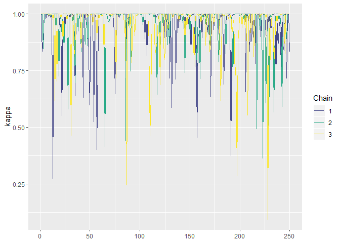
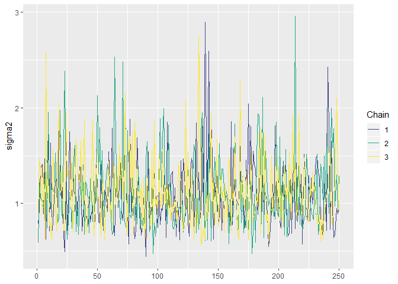
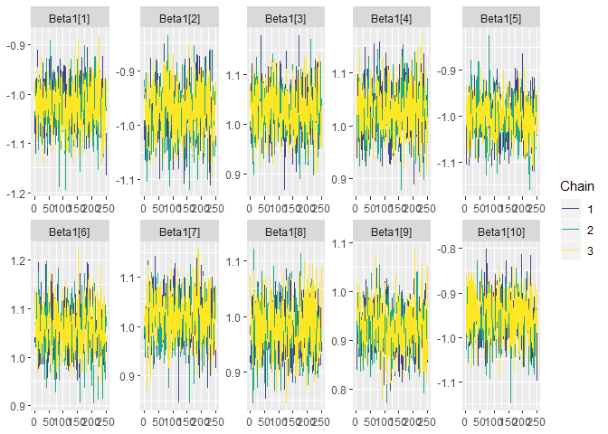
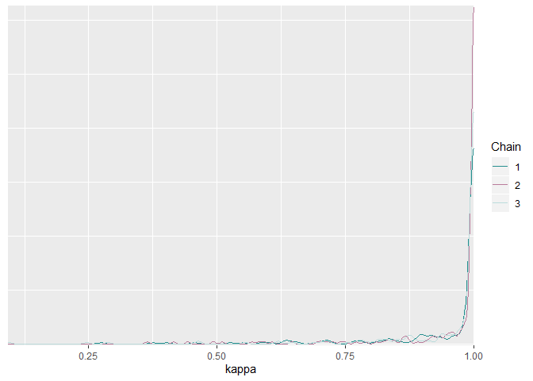
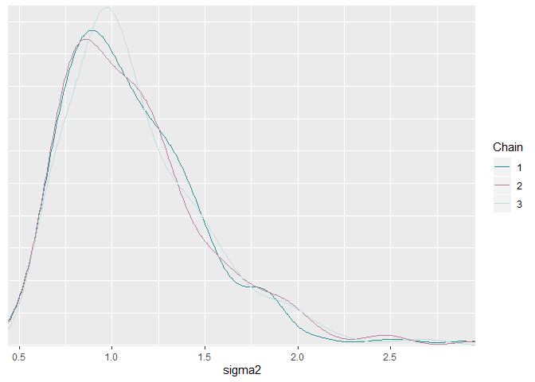
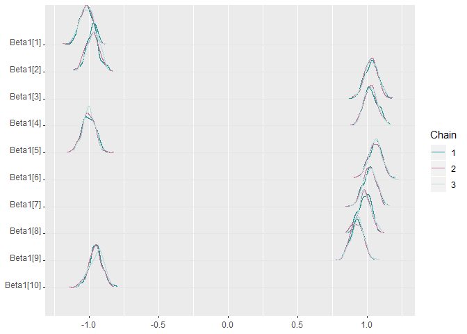
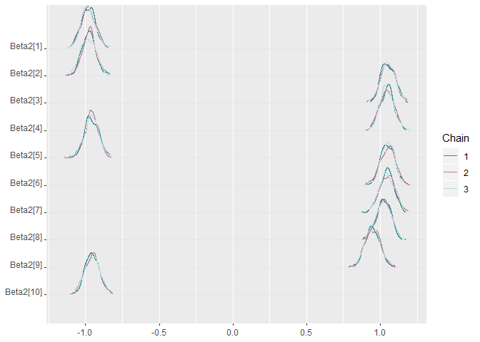
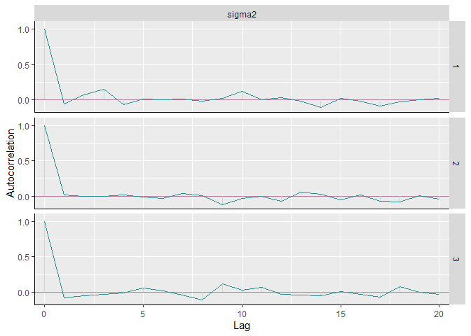
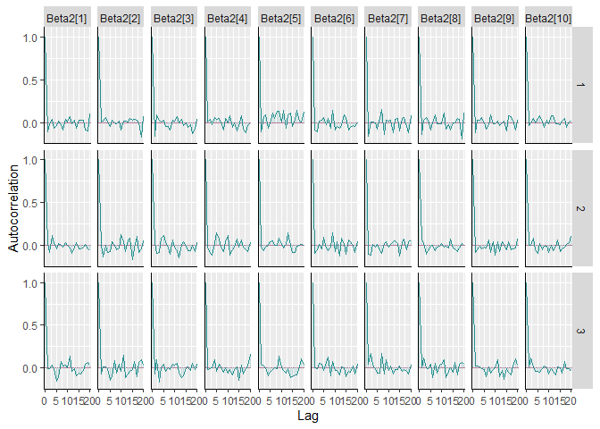

Getting Started
---------------

    library(GCPBayes)

Generating summary statistics
-----------------------------

    set.seed(1)
    mg=10
    SD=diag(0.05,mg)
    corr=0.5
    R=matrix(corr,mg,mg)+(1-corr)*diag(mg)
    Sigma=crossprod(crossprod(SD,R),SD)
    sign=rbinom(mg,1,.5)
    sign[sign==0]=-1
    betat=rep(1,mg)
    betat=betat*sign
    Betah=mvtnorm::rmvnorm(2,betat,Sigma)

    snpnames=1:mg
    genename="simulated_data"

    row.names(Betah)<-c("Study_1","Study_2")
    colnames(Betah)<-sprintf("%s",seq(1:mg))

    row.names(Sigma)<-sprintf("%s",seq(1:mg))
    colnames(Sigma)<-sprintf("%s",seq(1:mg))

    # generated Behath
    #print(Betah)
    #print(Sigma)

### Summary Statistics including betah\_k, Sigmah\_k, k=1,2

#### betah\_k, k=1,2

    |         | 1      | 2      | 3     | 4     | 5      | 6     | 7     | 8     | 9     | 10     |
    |---------|--------|--------|-------|-------|--------|-------|-------|-------|-------|--------|
    | Study_1 | -1.022 | -0.976 | 1.033 | 1.027 | -1.004 | 1.061 | 1.021 | 0.985 | 0.929 | -0.953 |
    | Study_2 | -0.979 | -0.978 | 1.056 | 1.051 | -0.957 | 1.055 | 1.050 | 1.025 | 0.952 | -0.956 |

#### Sigmah\_1=Sigmah\_2

    |    | 1       | 2       | 3       | 4       | 5       | 6       | 7       | 8       | 9       | 10      |
    |----|---------|---------|---------|---------|---------|---------|---------|---------|---------|---------|
    | 1  | 0.0025  | 0.00125 | 0.00125 | 0.00125 | 0.00125 | 0.00125 | 0.00125 | 0.00125 | 0.00125 | 0.00125 |
    | 2  | 0.00125 | 0.0025  | 0.00125 | 0.00125 | 0.00125 | 0.00125 | 0.00125 | 0.00125 | 0.00125 | 0.00125 |
    | 3  | 0.00125 | 0.00125 | 0.0025  | 0.00125 | 0.00125 | 0.00125 | 0.00125 | 0.00125 | 0.00125 | 0.00125 |
    | 4  | 0.00125 | 0.00125 | 0.00125 | 0.0025  | 0.00125 | 0.00125 | 0.00125 | 0.00125 | 0.00125 | 0.00125 |
    | 5  | 0.00125 | 0.00125 | 0.00125 | 0.00125 | 0.0025  | 0.00125 | 0.00125 | 0.00125 | 0.00125 | 0.00125 |
    | 6  | 0.00125 | 0.00125 | 0.00125 | 0.00125 | 0.00125 | 0.0025  | 0.00125 | 0.00125 | 0.00125 | 0.00125 |
    | 7  | 0.00125 | 0.00125 | 0.00125 | 0.00125 | 0.00125 | 0.00125 | 0.0025  | 0.00125 | 0.00125 | 0.00125 |
    | 8  | 0.00125 | 0.00125 | 0.00125 | 0.00125 | 0.00125 | 0.00125 | 0.00125 | 0.0025  | 0.00125 | 0.00125 |
    | 9  | 0.00125 | 0.00125 | 0.00125 | 0.00125 | 0.00125 | 0.00125 | 0.00125 | 0.00125 | 0.0025  | 0.00125 |
    | 10 | 0.00125 | 0.00125 | 0.00125 | 0.00125 | 0.00125 | 0.00125 | 0.00125 | 0.00125 | 0.00125 | 0.0025  |

### runing DS function

> For running CS we consider three chains (nchains=3), the lengths of
> MCMC iteration and burn-in are set at 1000 and 500, respectively
> (niter=1000, burnin=500).  
> Also, we consider kappa0=c(0.5,0.25,0.5) and sigma20=c(1,1.25,1.5) as
> initial values. The hyperparameters are considered as a1=0.1, a2=0.1,
> d1=0.1 and d2=0.1.

    Betah1=Betah[1,]; Betah2=Betah[2,];
    Sigmah1=Sigma; Sigmah2=Sigma;
    res2 = DS(Betah1, Betah2,
              Sigmah1, Sigmah2,
              kappa0=c(0.5,0.25,0.6), sigma20=c(1,1.2,1.5),
              mg=mg, niter=1000, burnin=500,
              nchains=3, nthin=2, a1=0.1, a2=0.1, d1=0.1, d2=0.1,
              snpnames, genename)

    #print(round(res2$Outputs[[1]]$`Statistics of Trait 1 for Beta_1`,digits=2))
    #print(round(res2$Outputs[[1]]$`Statistics of Trait 2  for Beta_2`,digits=2))
    #print(round(res2$Outputs[[1]]$`Other Parameters`,digits=2))
    #print(round(res2$BGR[[1]],digits=2))
    #print(round(res2$BGR[[2]],digits=2))

#### Statistics of Trait 1 for Beta\_1 (only for chain 1)

    |       | Name of SNP | Mean  | SD   | val2.5pc | Median | val97.5pc |
    |-------|-------------|-------|------|----------|--------|-----------|
    | [1,]  | 1           | -0.94 | 0.05 | -1.04    | -0.93  | -0.85     |
    | [2,]  | 2           | 1.13  | 0.05 | 1.03     | 1.13   | 1.22      |
    | [3,]  | 3           | -0.94 | 0.06 | -1.05    | -0.94  | -0.83     |
    | [4,]  | 4           | -0.98 | 0.06 | -1.09    | -0.98  | -0.88     |
    | [5,]  | 5           | 1.03  | 0.05 | 0.94     | 1.03   | 1.13      |
    | [6,]  | 6           | -0.94 | 0.05 | -1.03    | -0.94  | -0.84     |
    | [7,]  | 7           | 1.02  | 0.05 | 0.93     | 1.02   | 1.12      |
    | [8,]  | 8           | -0.95 | 0.05 | -1.04    | -0.95  | -0.85     |
    | [9,]  | 9           | 1.06  | 0.05 | 0.97     | 1.06   | 1.16      |
    | [10,] | 10          | 1.01  | 0.06 | 0.9      | 1.01   | 1.11      |

#### Statistics of Trait 2 for Beta\_2 (only for chain 1)

    |       | Name of SNP | Mean  | SD   | val2.5pc | Median | val97.5pc |
    |-------|-------------|-------|------|----------|--------|-----------|
    | [1,]  | 1           | -1.03 | 0.05 | -1.12    | -1.02  | -0.92     |
    | [2,]  | 2           | 0.96  | 0.05 | 0.84     | 0.97   | 1.06      |
    | [3,]  | 3           | -1.07 | 0.05 | -1.17    | -1.07  | -0.99     |
    | [4,]  | 4           | -1.03 | 0.05 | -1.14    | -1.03  | -0.92     |
    | [5,]  | 5           | 1.02  | 0.05 | 0.92     | 1.02   | 1.12      |
    | [6,]  | 6           | -1.09 | 0.05 | -1.19    | -1.1   | -1        |
    | [7,]  | 7           | 1     | 0.05 | 0.91     | 1      | 1.09      |
    | [8,]  | 8           | -1.02 | 0.05 | -1.11    | -1.02  | -0.93     |
    | [9,]  | 9           | 0.93  | 0.05 | 0.83     | 0.93   | 1.02      |
    | [10,] | 10          | 0.98  | 0.05 | 0.88     | 0.98   | 1.07      |

#### Statistics of Other Parameters (only for chain 1)

    |        | Mean | SD   | val2.5pc | Median | val97.5pc |
    |--------|------|------|----------|--------|-----------|
    | kappa  | 0.95 | 0.12 | 0.55     | 1      | 1         |
    | sigma2 | 1.1  | 0.36 | 0.64     | 1.02   | 2.1       |

#### Gelman-Rubin convergence diagnostic for Beta\_k, k=1,2

    |       | Name of SNP | BGR for Beta_1 | BGR for Beta_2 |
    |-------|-------------|----------------|----------------|
    | [1,]  | 1           | 1.01           | 1.01           |
    | [2,]  | 2           | 1.01           | 1.01           |
    | [3,]  | 3           | 1              | 1              |
    | [4,]  | 4           | 1              | 1              |
    | [5,]  | 5           | 1.01           | 1.02           |
    | [6,]  | 6           | 1.03           | 1.02           |
    | [7,]  | 7           | 1              | 1.01           |
    | [8,]  | 8           | 1              | 1.03           |
    | [9,]  | 9           | 1.03           | 1.01           |
    | [10,] | 10          | 1.01           | 1.02           |

#### Gelman-Rubin convergence diagnostic for Other Parameters

    |      | kappa | sigma2 |
    |------|-------|--------|
    | [1,] | 1.06  | 1.01   |

### Trace, density and ACF Plots for unknown parameters

### Important criteria for chain 1

> The output of this part includes log\_10BF and lBFDR for testing H0
> and theta for detecting group pleiotropy. Also, detecting variable
> pleiotropy using the number of studies for each variable with nonzero
> signal by CI can be preformed.

    #print(res2$Outputs[[1]]$Criteria)

    ## $`Name of Gene`
    ## [1] "simulated_data"

    ## $`Name of SNP`
    ## [1]  1  2  3  4  5  6  7  8  9 10

    ## $log10BF
    ## [1] Inf

    ## $lBFDR
    ## [1] 0

    ## $theta
    ## [1] 1

    ## $`# studies nonzero signal by CI`
    ##  [1] 2 2 2 2 2 2 2 2 2 2

    ## $PPA1
    ## [1] 1

    ## $PPA2
    ## [1] 1
