Getting Started
---------------

    library(GCPBayes)

Generating summary statistics
-----------------------------

    set.seed(1)
    mg=10
    SD=diag(0.05,mg)
    corr=0.5
    R=matrix(corr,mg,mg)+(1-corr)*diag(mg)
    Sigma=crossprod(crossprod(SD,R),SD)
    sign=rbinom(mg,1,.5)
    sign[sign==0]=-1
    betat=rep(1,mg)
    betat=betat*sign
    Betah=mvtnorm::rmvnorm(2,betat,Sigma)

    snpnames=1:mg
    genename="simulated_data"

    row.names(Betah)<-c("Study_1","Study_2")
    colnames(Betah)<-sprintf("%s",seq(1:mg))

    row.names(Sigma)<-sprintf("%s",seq(1:mg))
    colnames(Sigma)<-sprintf("%s",seq(1:mg))

    # generated Behath
    #print(Betah)
    #print(Sigma)

### Summary Statistics including betah\_k, Sigmah\_k, k=1,2

#### betah\_k, k=1,2

    |         | 1      | 2      | 3     | 4     | 5      | 6     | 7     | 8     | 9     | 10     |
    |---------|--------|--------|-------|-------|--------|-------|-------|-------|-------|--------|
    | Study_1 | -1.022 | -0.976 | 1.033 | 1.027 | -1.004 | 1.061 | 1.021 | 0.985 | 0.929 | -0.953 |
    | Study_2 | -0.979 | -0.978 | 1.056 | 1.051 | -0.957 | 1.055 | 1.050 | 1.025 | 0.952 | -0.956 |

#### Sigmah\_1=Sigmah\_2

    |    | 1       | 2       | 3       | 4       | 5       | 6       | 7       | 8       | 9       | 10      |
    |----|---------|---------|---------|---------|---------|---------|---------|---------|---------|---------|
    | 1  | 0.0025  | 0.00125 | 0.00125 | 0.00125 | 0.00125 | 0.00125 | 0.00125 | 0.00125 | 0.00125 | 0.00125 |
    | 2  | 0.00125 | 0.0025  | 0.00125 | 0.00125 | 0.00125 | 0.00125 | 0.00125 | 0.00125 | 0.00125 | 0.00125 |
    | 3  | 0.00125 | 0.00125 | 0.0025  | 0.00125 | 0.00125 | 0.00125 | 0.00125 | 0.00125 | 0.00125 | 0.00125 |
    | 4  | 0.00125 | 0.00125 | 0.00125 | 0.0025  | 0.00125 | 0.00125 | 0.00125 | 0.00125 | 0.00125 | 0.00125 |
    | 5  | 0.00125 | 0.00125 | 0.00125 | 0.00125 | 0.0025  | 0.00125 | 0.00125 | 0.00125 | 0.00125 | 0.00125 |
    | 6  | 0.00125 | 0.00125 | 0.00125 | 0.00125 | 0.00125 | 0.0025  | 0.00125 | 0.00125 | 0.00125 | 0.00125 |
    | 7  | 0.00125 | 0.00125 | 0.00125 | 0.00125 | 0.00125 | 0.00125 | 0.0025  | 0.00125 | 0.00125 | 0.00125 |
    | 8  | 0.00125 | 0.00125 | 0.00125 | 0.00125 | 0.00125 | 0.00125 | 0.00125 | 0.0025  | 0.00125 | 0.00125 |
    | 9  | 0.00125 | 0.00125 | 0.00125 | 0.00125 | 0.00125 | 0.00125 | 0.00125 | 0.00125 | 0.0025  | 0.00125 |
    | 10 | 0.00125 | 0.00125 | 0.00125 | 0.00125 | 0.00125 | 0.00125 | 0.00125 | 0.00125 | 0.00125 | 0.0025  |

### runing HS function

> For running HS we consider three chains (nchains=3), the lengths of
> MCMC iteration and burn-in are set at 2000 and 1000, respectively
> (niter=2000, burnin=1000).  
> Also, we consider kappa0 = c(0.5,0.25,0.7),
> kappastar0=c(0.5,0.25,0.2), sigma20 =c(1,1.5,2) and s20 =c(1,1.5,2) as
> initial values. The hyperparameters are considered as a1=0.1, a2=0.1,
> d1=0.1, d2=0.1, c1=1, c2=1, e2=1 and e2=1.

    Betah1=Betah[1,]; Betah2=Betah[2,];
    Sigmah1=Sigma; Sigmah2=Sigma;
    a1=0.1; a2=0.1; d1=0.1; d2=0.1; c1=1; c2=1; e2=1; e2=1

    res2 = HS(Betah1, Betah2,
              Sigmah1, Sigmah2, kappa0 = c(0.5,0.25,0.7), kappastar0=c(0.5,0.25,0.2),
              sigma20 =c(1,1.5,2), s20 =c(1,1.5,2),
              mg=mg, niter=2000, burnin=1000, nthin=3, nchains=3, a1=a1, a2=a2, d1=d1,
              d2=d2, c1=c1, c2=c2, e2=e2, snpnames, genename)

    #print(round(res2$Outputs[[1]]$`Statistics of Trait 1 for Beta_1`,digits=2))
    #print(round(res2$Outputs[[1]]$`Statistics of Trait 2  for Beta_2`,digits=2))
    #print(round(res2$Outputs[[1]]$`Other Parameters`,digits=2))
    #print(round(res2$BGR[[1]],digits=2))
    #print(round(res2$BGR[[2]],digits=2))

#### Statistics of Trait 1 for Beta\_1 (only for chain 1)

    |       | Name of SNP | Mean  | SD   | val2.5pc | Median | val97.5pc |
    |-------|-------------|-------|------|----------|--------|-----------|
    | [1,]  | 1           | -1.02 | 0.05 | -1.12    | -1.03  | -0.92     |
    | [2,]  | 2           | -0.98 | 0.05 | -1.07    | -0.98  | -0.88     |
    | [3,]  | 3           | 1.03  | 0.05 | 0.94     | 1.03   | 1.13      |
    | [4,]  | 4           | 1.02  | 0.05 | 0.94     | 1.02   | 1.12      |
    | [5,]  | 5           | -1    | 0.05 | -1.1     | -1.01  | -0.91     |
    | [6,]  | 6           | 1.06  | 0.05 | 0.98     | 1.06   | 1.16      |
    | [7,]  | 7           | 1.01  | 0.05 | 0.92     | 1.01   | 1.11      |
    | [8,]  | 8           | 0.98  | 0.05 | 0.89     | 0.99   | 1.08      |
    | [9,]  | 9           | 0.92  | 0.05 | 0.82     | 0.92   | 1.02      |
    | [10,] | 10          | -0.95 | 0.05 | -1.05    | -0.95  | -0.86     |

#### Statistics of Trait 2 for Beta\_2 (only for chain 1)

    |       | Name of SNP | Mean  | SD   | val2.5pc | Median | val97.5pc |
    |-------|-------------|-------|------|----------|--------|-----------|
    | [1,]  | 1           | -0.99 | 0.05 | -1.08    | -0.99  | -0.89     |
    | [2,]  | 2           | -0.98 | 0.05 | -1.08    | -0.98  | -0.89     |
    | [3,]  | 3           | 1.05  | 0.05 | 0.96     | 1.05   | 1.15      |
    | [4,]  | 4           | 1.04  | 0.05 | 0.94     | 1.04   | 1.14      |
    | [5,]  | 5           | -0.96 | 0.05 | -1.06    | -0.96  | -0.87     |
    | [6,]  | 6           | 1.04  | 0.05 | 0.96     | 1.04   | 1.14      |
    | [7,]  | 7           | 1.04  | 0.05 | 0.93     | 1.04   | 1.14      |
    | [8,]  | 8           | 1.01  | 0.05 | 0.91     | 1.01   | 1.11      |
    | [9,]  | 9           | 0.94  | 0.05 | 0.84     | 0.94   | 1.04      |
    | [10,] | 10          | -0.97 | 0.05 | -1.06    | -0.96  | -0.87     |

#### Statistics of Other Parameters (only for chain 1)

    |           | Mean | SD   | val2.5pc | Median | val97.5pc |
    |-----------|------|------|----------|--------|-----------|
    | kappa     | 0.96 | 0.1  | 0.62     | 1      | 1         |
    | kappastar | 0.96 | 0.04 | 0.86     | 0.97   | 1         |
    | sigma2    | 1.11 | 0.4  | 0.61     | 1.02   | 2.27      |
    | s2        | 1.72 | 0.59 | 0.94     | 1.62   | 3.16      |

#### Gelman-Rubin convergence diagnostic for Beta\_k, k=1,2

    |       | Name of SNP | BGR for Beta_1 | BGR for Beta_2 |
    |-------|-------------|----------------|----------------|
    | [1,]  | 1           | 1              | 1.02           |
    | [2,]  | 2           | 1              | 0.99           |
    | [3,]  | 3           | 1              | 1              |
    | [4,]  | 4           | 1              | 1.01           |
    | [5,]  | 5           | 1.04           | 1.01           |
    | [6,]  | 6           | 1.02           | 1              |
    | [7,]  | 7           | 1.01           | 1.02           |
    | [8,]  | 8           | 0.98           | 1              |
    | [9,]  | 9           | 1              | 1.01           |
    | [10,] | 10          | 0.99           | 1.01           |

#### Gelman-Rubin convergence diagnostic for Other Parameters

    |      | kappa | kappastar | sigma2 |
    |------|-------|-----------|--------|
    | [1,] | 0.99  | 1         | 1      |

### Trace, density and ACF Plots for unknown parameters

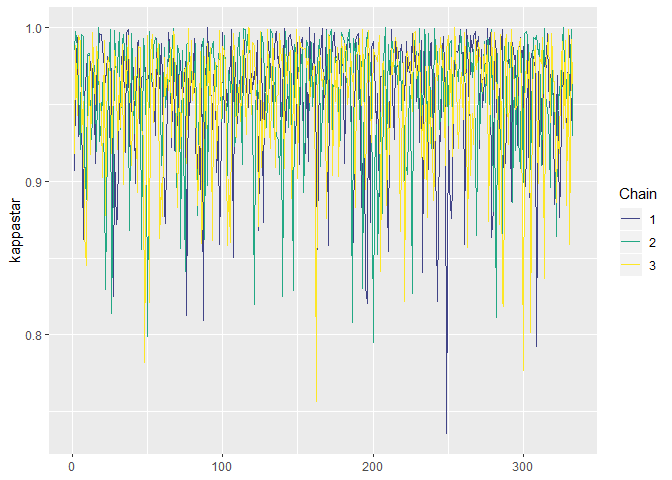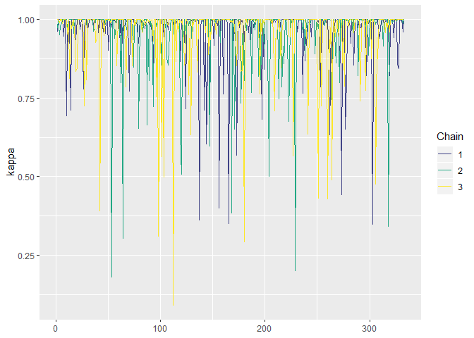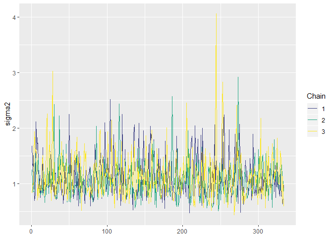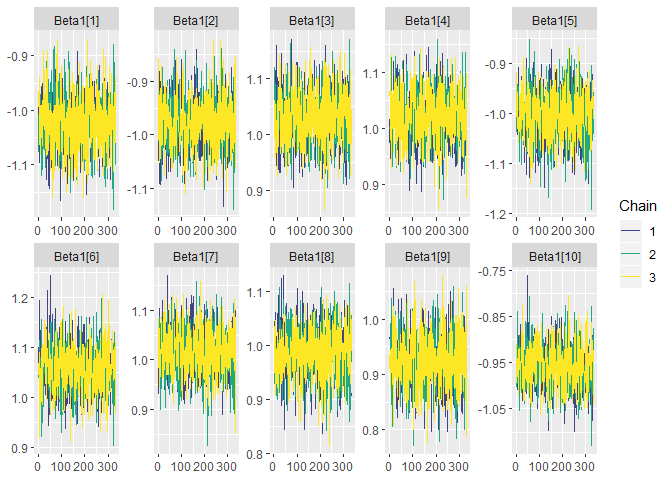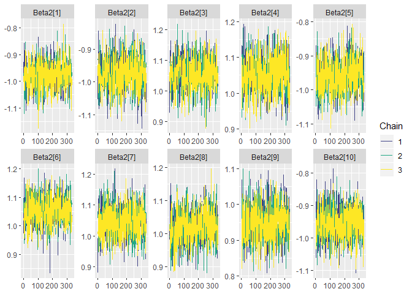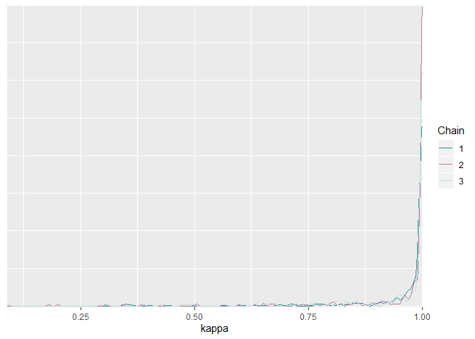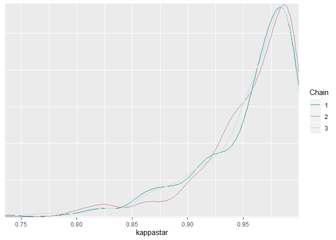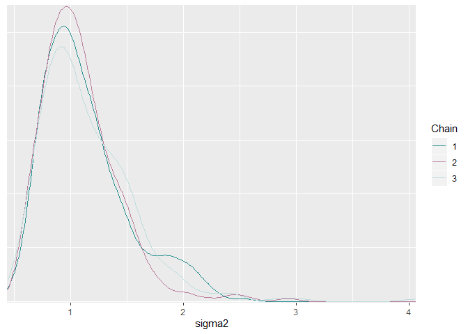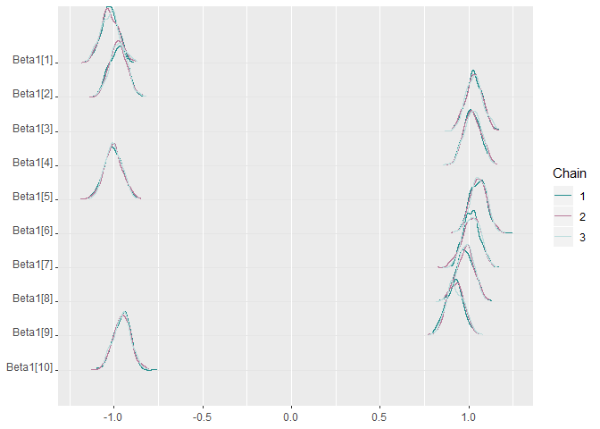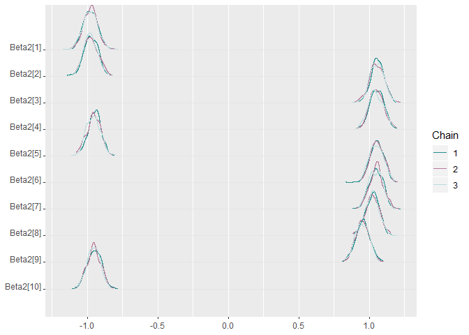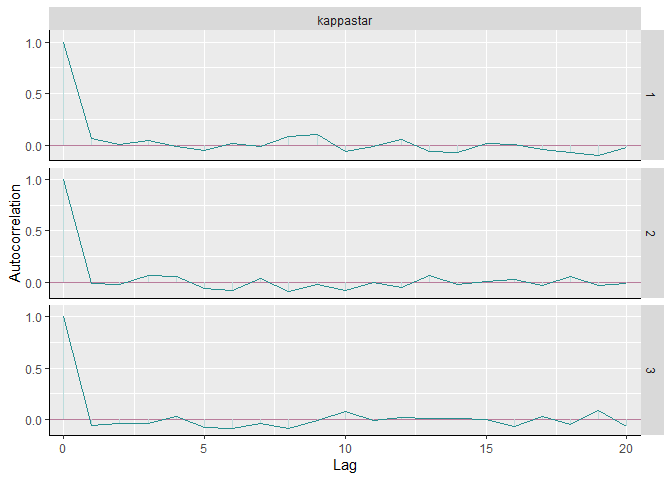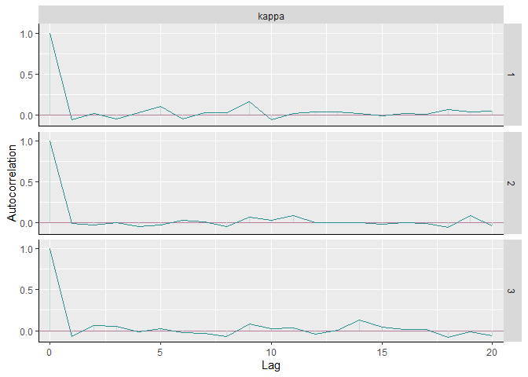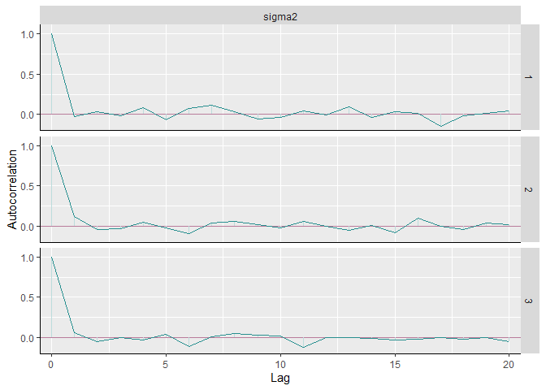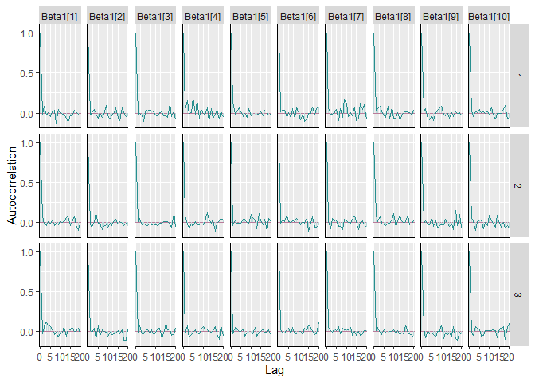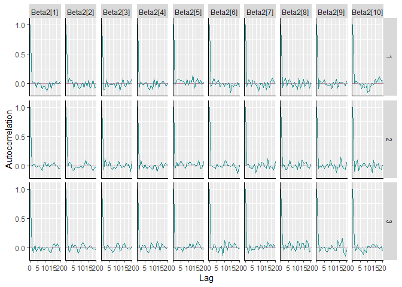 

### Important criteria for chain 1

> The output of this part includes detecting variable pleiotropy using
> the number of studies for each variable with nonzero signal by CI and
> median.

    #print(res2$Outputs[[1]]$Criteria)

    ## $`Name of Gene`
    ## [1] "simulated_data"

    ## $`Name of SNP`
    ## [1]  1  2  3  4  5  6  7  8  9 10

    ## $`# studies nonzero signal by CI`
     [1] 2 2 2 2 2 2 2 2 2 2

    ## $`# studies nonzero signal by Med`
     [1] 2 2 2 2 2 2 2 2 2 2
